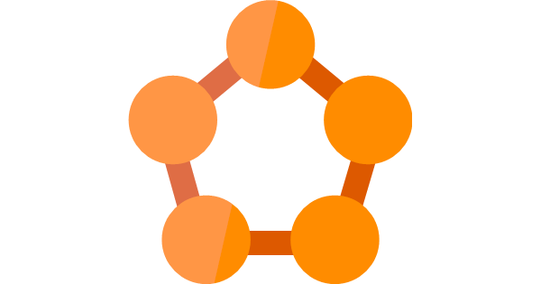

# Pluralsight: Azure Service Fabric Programming Models

This repository contains sample code for my Pluralsight course "Azure Service Fabric Programming Models".

See appropriate folder for each module's complete code (M3, M4 etc.)

