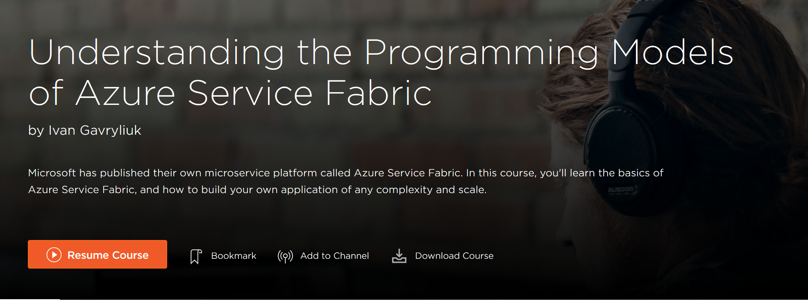

# Pluralsight: Azure Service Fabric Programming Models

This repository contains sample code for my Pluralsight course [Understanding the Programming Models of Azure Service Fabric](https://app.pluralsight.com/library/courses/azure-service-fabric-programming-models/table-of-contents)

See appropriate folder for each module's complete code (M4, M5 etc.).

Updated course is only using `.NET Core` as opposed to the old course that was using `.NET Framework`. Plese consider using .NET Core for all of your project as .NET Framework gets supported less and less, and some of SF features are not in .NET Framework anymore.